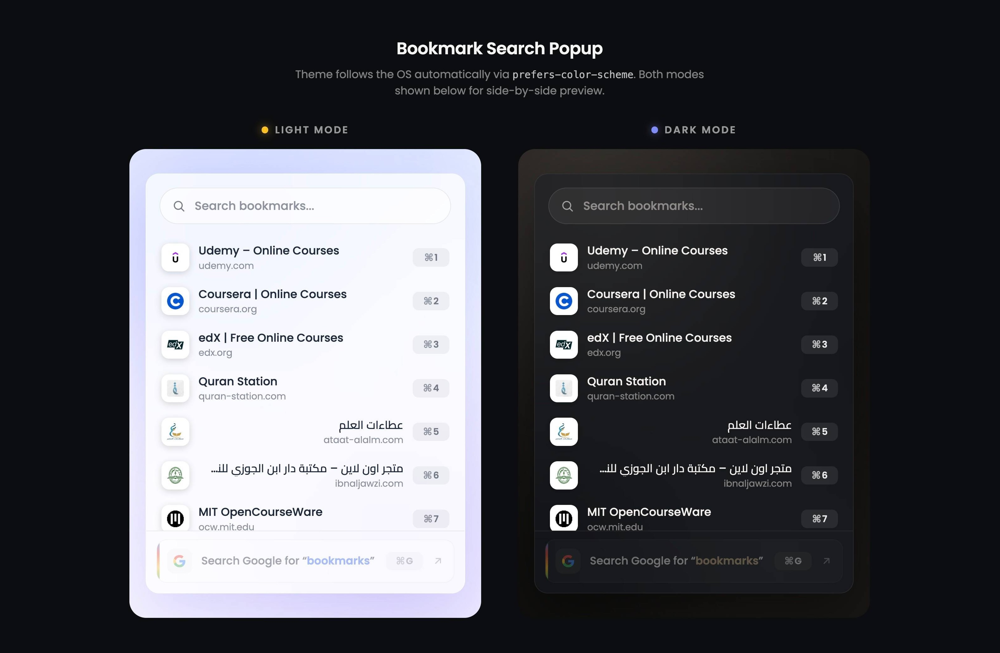

<p align="center">
  <a href="https://2ff8dacb-b398-4347-af37-84545368208b.claudeusercontent.com/v1/design/projects/2ff8dacb-b398-4347-af37-84545368208b/serve/Quran%20Tab%20Bookmark%20Popup-print.dc.html?t=57e4a9ebb54bc3c5a027900d6ffffe5892aa32d75f4c909680b8e0a32febf411.8d3e955d-8810-476a-8a5b-e7423333ad00.1a45149c-652a-480a-a3ea-079130ec219f.1783965591&direct=1" target="_blank"></a>
</p>

# Bookmark Search

A fast, keyboard-first Chrome extension popup for searching your bookmarks. Built with [Plasmo](https://www.plasmo.com/), React, TypeScript, and Sass, with a frosted-glass UI that follows your system's light/dark theme automatically.

## Features

- **Fuzzy search** — matches don't need to be exact or contiguous; results are ranked by relevance across title, domain, and immediate parent folder, so a quick, imprecise query like `gthb` still finds `github.com`.
- **Live bookmark count** — the search placeholder shows your total bookmark count (e.g. `Search 128 Bookmarks or Google...`), so you always know how much is being searched.
- **⚡ Fast Google Search:** Pressing `Enter` while focused on the search input instantly triggers a Google search for your query, mirroring the behavior of `⌘G` / `Ctrl+G` without needing to navigate downwards.
- **♿ Full Accessibility (A11y):** Supports standard accessibility practices. Users can naturally navigate through search results and controls using `Tab` and `Shift+Tab`, with clear focus indicators for a seamless keyboard-only experience.
- **Keyboard-driven** — no mouse required:
  - `⌘E` / `Ctrl+E` — open the popup from anywhere in the browser.
  - `⌘1`–`⌘9` / `Ctrl+1`–`Ctrl+9` — jump straight to one of the visible results.
  - `⌘G` / `Ctrl+G` (or `Enter`) — run a Google search for your current query.
  - `Backspace` — instantly returns focus to the search input, no matter where focus currently is in the popup.
- **Smart tab reuse** — opening a bookmark reuses the current tab if it's an empty new tab, or opens a new tab alongside your existing one if you're al
  ready browsing a site, so you never lose your place.
- **Real favicons** — pulled via Chrome's extension favicon API, with a clean fallback icon if one fails to load.
- **Delete bookmarks in place** — hover a result to reveal a delete button in place of its favicon.
- **Folder context** — each result shows the domain and, if it lives in a subfolder, that folder's name (e.g. `Work • github.com`). The default "Bookmarks bar" root is never shown, since it adds no information.
- **RTL support** — Arabic bookmark titles are detected automatically and the row flips to right-aligned, `dir="rtl"` layout.
- **Automatic theming** — light/dark mode follows `prefers-color-scheme`; there's no manual toggle.
- **🎨 Premium Glassmorphism UI:** Seamless auto-switching dark/light theme driven natively by `prefers-color-scheme`. Implements a frosted-glass look with dynamic blurs (`blur(24px)`) and ambient glow backdrops.

## Getting started

```bash
pnpm install
pnpm build
```

Then load the unpacked extension in Chrome:

1. Go to `chrome://extensions`.
2. Enable **Developer mode**.
3. Click **Load unpacked** and select the `build/chrome-mv3-dev` folder.

Any code change hot-reloads the extension automatically while `pnpm dev` is running.

### Production build

```bash
pnpm build
```

Outputs an unpacked, production-ready build to `build/chrome-mv3-prod`. Use `pnpm package` to zip it for submission to the Chrome Web Store.

## Project structure

```
src/
  popup.tsx              Extension popup entry point
  background.ts          Service worker (handles the ⌘E / Ctrl+E launcher shortcut)
  components/             UI components (SearchBar, BookmarkRow, GoogleFallbackRow, icons)
  lib/                     bookmarks.ts, favicon.ts, tabs.ts, platform.ts, rtl.ts
  styles/                  Sass partials (design tokens, layout)
  style.scss              Sass entry point
```

## Permissions

| Permission                      | Why                                                       |
| ------------------------------- | --------------------------------------------------------- |
| `bookmarks`                     | Read the bookmark tree to power search.                   |
| `favicon`                       | Resolve favicons through Chrome's built-in favicon API.   |
| `host_permissions: https://*/*` | Needed for the favicon API to resolve icons for any site. |

## Notes

- The `⌘E` / `Ctrl+E` shortcut is registered as a custom `commands` entry (not the built-in `_execute_action`) with a background listener calling `chrome.action.openPopup()`, since `_execute_action` shortcuts aren't reliably honored on macOS.
- Chrome only applies a `suggested_key` the first time a command is registered. If you change the shortcut in `package.json` after the extension has already been loaded once, you'll need to rebind it manually at `chrome://extensions/shortcuts`.
